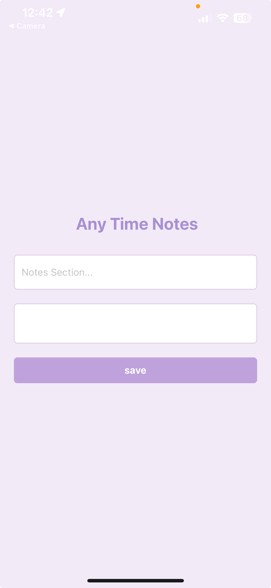

# Any Time Notes
***Any Time Notes*** is an innovative application designed for both offline and online use, enabling users to capture and store their thoughts, ideas, and notes at any moment without the need for an internet connection. This application seamlessly combines the convenience of mobile note-taking with the reliability and scalability of cloud storage
#### Demo Link: https://youtu.be/2kvJ305eHT8
## Key components:

- ### Client: React Native Application with Expo
    - ### Setup Steps:
  
      1. Creation and running of the React-Native application
      2. **Project Initialization:** Run the following command in command line in the root folder location
            ```commandline
            npx create-expo-app Everywhere
            
            cd Everywhere
            
            npx expo start
            ```
         This will create the React Native project and start the application. 
      3. The application can be tested on web browser or android device or ios device by scanning the QR code generated after running command npx expo start. Which will redirect to the Expo Go application installed on the device.
      4. **Web Browser Testing:** In web browser the application will be running on port 8081.

- ### Backend: Amplify Service
    - AWS amplify complete backend service with integrated database and backend services solution to easily integrate with full stack web, mobile applications.
    - Services can be configured with Amplify CLI
    - ### Setup Steps:

      - System Prerequisites: System with following packages, frameworks installed on the system
        ```commandline
        Node.js v14.x or later
        npm v6.14.4 or later
        git v2.14.1 or later
        ```
      1. Installing AWS - Amplify package
            ```commandline
         npm install -g @aws-amplify/cli
         ```
      2. To configure Amplify with AWS account, run the following command to configure the AWS details to the Amplify Services
            ```commandline
         amplify configure
         ```
      3. The corresponding services and following policies are added to the IAM user
            ```
         AdministratorAccess-Amplify
         ```
      4. The IAM user access key id and the security key are configured to AWS amplify services through cli
      5. **Backend Initialization and Library Installation:** Initialising the backend services using following command
            ```commandline
         amplify init
         ```
      6. Installing the necessary amplify libraries using following command
            ```commandline
         npm install aws-amplify @aws-amplify/react-native @react-native-community/netinfo @react-native-async-storage/async-storage react-native-get-random-values
         ```
      7. Set the conflict detection configuration to true and select one of the resolution strategy eg: Auto-merge
      8. Configure model schema in Amplify
            ```commandline
         amplify/backend/api/your-api-name/schema.graphql file
         ``` 
      8. **Schema Configuration:** Define your data models in the `schema.graphql` file and push the configurations to the cloud.
            ```commandline 
         amplify push
         ```
         This will push the latest model schema changes to the cloud.

- ### Datastore: AWS Datastore

    - A local database stored on the device which is used for offline support and automatic cloud synchronization when online

  - ### Setup Steps:
    1. Defining data model in the `schema.graphql` file.
        ```commandline
       type Notes @model {
       id: ID!
       heading: String
       message: String
       }
       ```
    2. Get and Post the objects to the datastore using 
        ```commandline
       await DataStore.query(Model)
       await DataStore.save()
       ```
    3. Check the status of the amplify backend service by running following command
        ```commandline
       amplify status
       ```
    4. Generate the amplify codegen models on the backend services by running following command
        ```commandline
       amplify codegen models
       ```
       which will generate resolvers and getters to the model.
    5. Push the latest schema changes to the cloud by running the following command
        ```commandline
       amplify push
       ```
    6. Local Datastore value can be cleared with 
        ```commandline
       Amplify.DataStore.clear()
       ```
    The syncing of data values to the cloud is done soon the application is online till then the values will be stored on the local device. 


## Starting Application:

- **System Prerequisites:**
    ```commandline
  Node.js v14.x or later
  npm v6.14.4 or later
  git v2.14.1 or later
  ```
  
- **Repository Cloning:** Clone the following github repository:
    ```commandline
  https://github.com/Leelakrishna2091997/Everywhere-Note.git
  ```
- **Dependency Installation:** Install the required packages by running following command:
    ```commandline
  npm install
  ```
- **Application Launch:** Start the client by running the following command:
    ```commandline
  npx expo start
  ```
  This will start the application, can be checked on mobile by scanning the QR code which will redirect to Expo Go application.
- On web browser the application can be tested on the port *8081* in *local*
- Amplify backend services status can be checked by running the following command:
    ```commandline
  amplify status
  ```
  which will display the active API services which are up.
    ```commandline
  ┌──────────┬───────────────────┬───────────┬───────────────────┐
  │ Category │ Resource name     │ Operation │ Provider plugin   │
  ├──────────┼───────────────────┼───────────┼───────────────────┤
  │ Api      │ everywherebackend │ No Change │ awscloudformation │
  └──────────┴───────────────────┴───────────┴───────────────────┘
  ```
- Now client and backend services are up and running, the application can be opened on Android or IOS device by scanning the QR code 
- The application UI is as follows

- #### Application Interface and Functionality:
    Users can input and save their notes by hitting save button. Offline data is stored locally and synchronized with AWS DynamoDB when online

- After user hits the save button, if application is offline then the data will be saved on to the local device, soon if the application is online the data will be saved to the AWS cloud Dynamo DB which can be checked at the corresponding model table details.
- Thank you for choosing **Any Time Notes** for your note-taking needs. Enjoy the seamless experience of capturing your thoughts anytime, anywhere.
